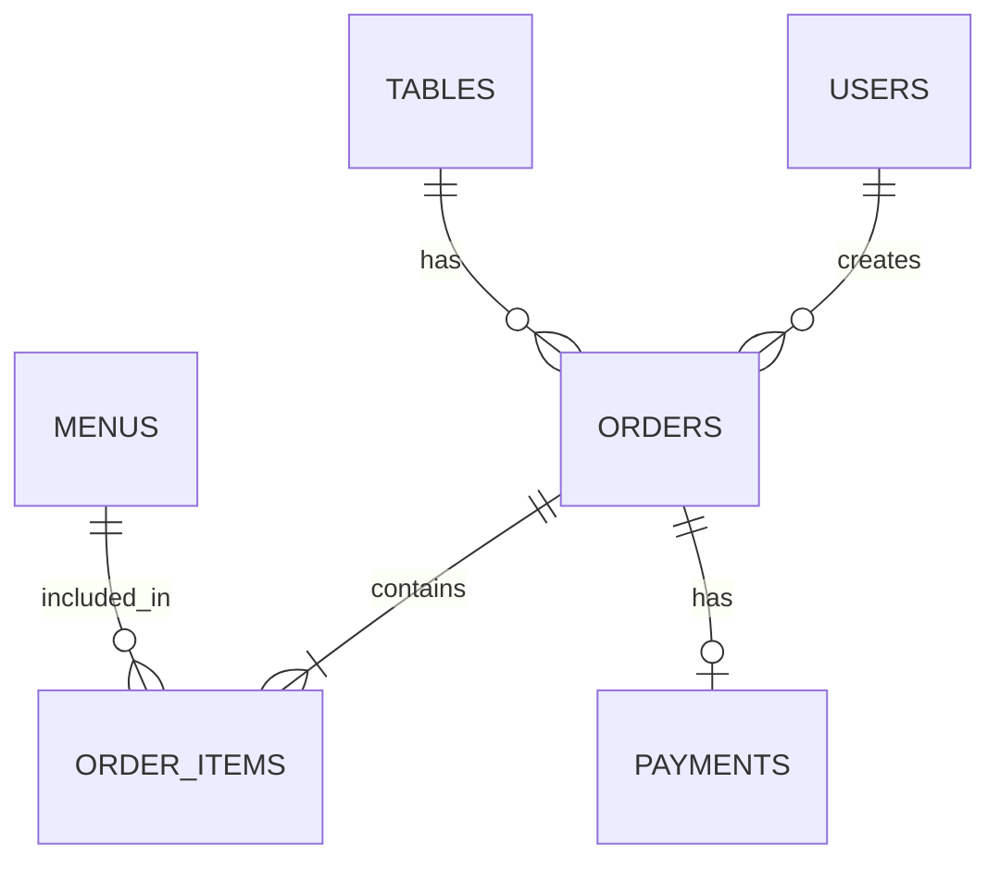
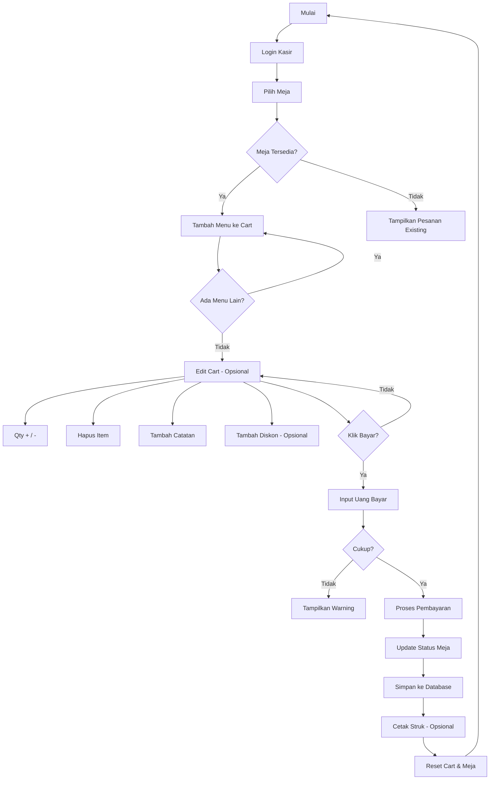
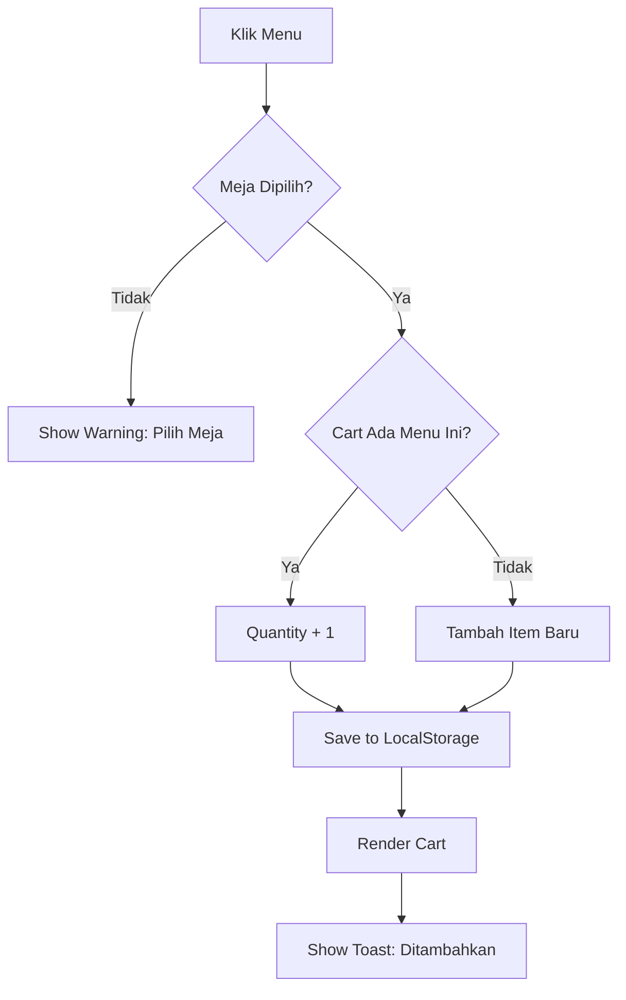
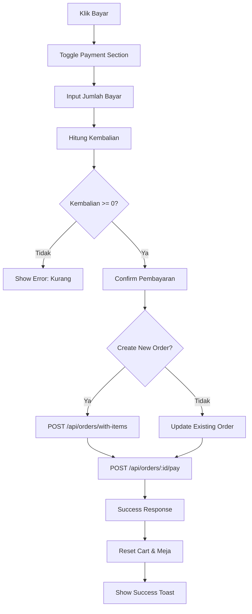
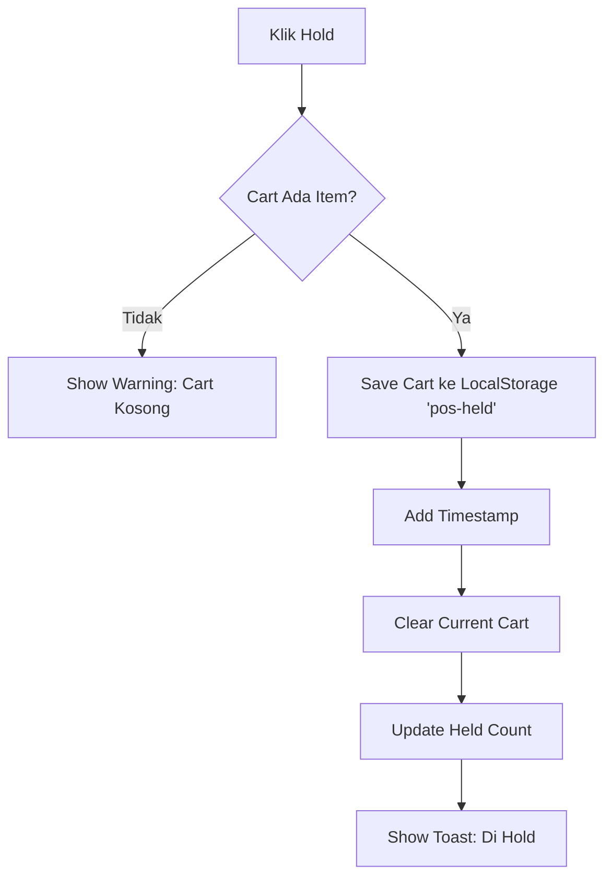

# Issue: POS Module Testing, ERD & Flowchart Improvement

## Objective
Memperbaiki dan mendokumentasikan sistem POS dengan cara:
1. Menguji modul POS secara menyeluruh dan memperbaiki kekurangan
2. Membuat ERD (Entity Relationship Diagram) yang menghubungkan modul POS dengan modul lain
3. Membuat flowchart optimal untuk alur kerja POS

---

## Bagian 1: Testing Modul POS dan Perbaikan

### Tahap 1.1: Identifikasi Kelemahan Melalui Testing
Lakukan testing manual dan otomatis untuk menemukan bug atau fitur yang kurang:

**1.1.1 Testing Alur Utama:**
- [ ] Login sebagai kasir → akses halaman POS
- [ ] Pilih meja (tersedia/terisi)
- [ ] Tambah menu ke cart
- [ ] Edit quantity item di cart
- [ ] Hapus item dari cart
- [ ] Tambah catatan pada item
- [ ] Terapkan diskon (Rp atau %)
- [ ] Proses pembayaran
- [ ] Cetak struk (jika ada)
- [ ] Reset setelah pembayaran

**1.1.2 Testing Fitur Tambahan:**
- [ ] Hold order → simpan ke localStorage
- [ ] Recall order dari hold
- [ ] Transfer meja
- [ ] Tambah meja baru (admin)
- [ ] Filter menu (Semua/Makanan/Minuman)
- [ ] Search menu

**1.1.3 Testing edge cases:**
- [ ] Tambah item sama dua kali (quantity harusnya increment)
- [ ] Quantity jadi 0 → item dihapus
- [ ] Pembayaran dengan uang pas
- [ ] Pembayaran kurang → tidak bisa proceed
- [ ] Discount > subtotal → bagaimana?
- [ ] Many items di cart → scroll bekerja

**1.1.4 Testing responsif:**
- [ ] Tampilan di HP/tablet
- [ ] Touch interaction untuk + / - buttons

### Tahap 1.2: Dokumentasi Kelemahan
Buat list bug dan improvement dalam format:
```
## Bug yang Ditemukan

### Bug 1: [Judul]
- Lokasi: [file/fitur]
- Deskripsi: [apa yang terjadi]
- Expected: [apa yang seharusnya]
- Severity: [Critical/High/Medium/Low]

### Improvement 1: [Judul]
- Lokasi: [file/fitur]
- Deskripsi: [apa yang perlu dikembangkan]
- Priority: [High/Medium/Low]
```

### Tahap 1.3: Implementasi Perbaikan
Untuk setiap bug/improvement yang ditemukan:
1. Reproduce bug →确认 bug ada
2. Analisa cause →找出原因
3. Fix atau develop →进行修复或开发
4. Test ulang →验证修复

---

## Bagian 2: Pembuatan ERD Antar Modul

### Tahap 2.1: Identifikasi Entitas yang Berhubungan dengan POS
Buat list semua tabel/database yang berinteraksi dengan POS:

**Entitas Utama POS:**
- `orders` - Pesanan utama
- `order_items` - Item-item dalam pesanan
- `tables` - Meja restoran
- `menus` - Menu makanan/minuman
- `users` - user (kasir, admin, dll)

**Entitas Pendukung:**
- `payments` - Pembayaran
- `shifts` - Shift kerja
- `inventory` - Inventory (jika terhubung)

### Tahap 2.2: Membuat Diagram ERD

Gunakan tools seperti:
- Draw.io / Lucidchart
- DBML (dbml-lang.org)
- Mermaid.js

**Format ERD (Mermaid):**


**Detail Setiap Entitas:**

```markdown
## Orders
- id (PK)
- table_id (FK)
- user_id (FK)
- status (pending/cooking/ready/paid/cancelled)
- subtotal
- tax
- discount
- discount_type (fixed/percentage)
- total
- payment_method (opsional)
- amount_paid
- change_amount
- created_at
- updated_at

## Order_Items
- id (PK)
- order_id (FK)
- menu_id (FK)
- quantity
- price_at_order (harga saat pesanan dibuat)
- notes (catatan khusus)
- created_at

## Tables
- id (PK)
- table_number
- status (available/occupied)
- created_at

## Menus
- id (PK)
- name
- price
- category (makanan/minuman)
- description
- is_available
- created_at
```

### Tahap 2.3: Dokumentasi Relasi
Jelaskan setiap relasi:
```
1. Users → Orders: 1 user bisa buat banyak orders
2. Tables → Orders: 1 meja bisa punya banyak orders (terurut)
3. Orders → Order_items: 1 order punya banyak items
4. Menus → Order_items: 1 menu bisa ada di banyak order_items
5. Orders → Payments: 1 order punya 1 payment
```

---

## Bagian 3: Pembuatan Flowchart POS

### Tahap 3.1: Identifikasi Semua Aktivitas
List semua aktivitas yang bisa dilakukan di POS:

1. **Start** - Kasir login
2. **Pilih Meja** - Klik nomor meja
3. **Tambah Menu** - Klik menu di list
4. **Edit Cart** - Ubah quantity, hapus item, tambah notes
5. **Diskon** - Input diskon (optional)
6. **Bayar** - Klik tombol Bayar
7. **Input Pembayaran** - Masukkan uang diterima
8. **Proses** - Sistem hitung kembalian
9. **Selesai** - Reset, struk (optional)

### Tahap 3.2: Buat Flowchart Utama (Mermaid)



### Tahap 3.3: Buat Flowchart Detail per Fitur

**3.3.1 Flowchart Tambah Menu:**


**3.3.2 Flowchart Pembayaran:**


**3.3.3 Flowchart Hold Order:**


### Tahap 3.4: Simpan Dokumentasi
Simpan semua flowchart dalam format:
- **Mermaid** (.md) - untuk version control
- **PNG/PDF** - untuk presentasi/diskusi

---

## Checklist Akhir

### Deliverables:
- [ ] Laporan testing POS (bug & improvement list)
- [ ] ERD diagram (format Mermaid + visual)
- [ ] Flowchart utama POS
- [ ] Flowchart detail per fitur
- [ ] Kode fix untuk bug yang critical

### Tools yang Dibutuhkan:
- VS Code (edit kode)
- Draw.io / Lucidchart (visual diagram)
- Mermaid.js (code-based diagram)
- Browser DevTools (testing)

### Estimasi Waktu:
- Testing: 2-4 jam
- ERD: 1-2 jam
- Flowchart: 2-3 jam
- Fixing critical bugs: 3-5 jam

**Total: ~8-14 jam**

---

## Catatan untuk Junior Programmer/AI

1. **Jangan langsung coding** - Baca dulu dokumentasi yang ada
2. **Test dulu** - Repro bug sebelum fix
3. **Commit sering** - Setiap fitur kecil = 1 commit
4. **Test manual** - Cek browser, bukan hanya code
5. ** Tanya jika bingung ** - Minta klarifikasi sebelum假设

**Priority Pertama:** Testing & Fix Bug Critical
**Priority Kedua:** ERD & Flowchart
**Priority Ketiga:** Improvement non-critical