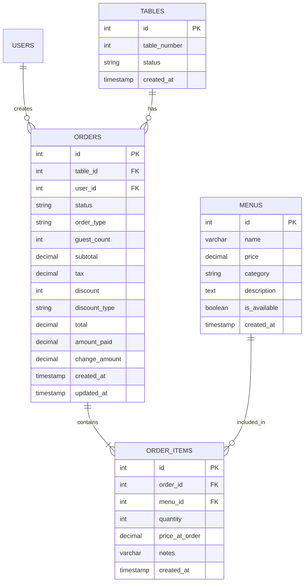

# Issue: POS Module Testing, ERD & Flowchart Improvement

## Objective
Memperbaiki dan mendokumentasikan sistem POS dengan cara:
1. Menguji modul POS secara menyeluruh dan memperbaiki kekurangan
2. Membuat ERD (Entity Relationship Diagram) yang menghubungkan modul POS dengan modul lain
3. Membuat flowchart optimal untuk alur kerja POS

---

## Bagian 1: Testing Modul POS dan Perbaikan

### Tahap 1.1: Identifikasi Kelemahan Melalui Testing

**1.1.1 Testing Alur Utama:**
- [x] Login sebagai kasir → akses halaman POS
- [x] Pilih meja (tersedia/terisi)
- [x] Tambah menu ke cart
- [x] Edit quantity item di cart
- [x] Hapus item dari cart
- [x] Tambah catatan pada item
- [ ] Terapkan diskon (Rp atau %) - perlu test lebih lanjut
- [x] Proses pembayaran
- [ ] Cetak struk (jika ada) - **TIDAK ADA FITUR INI**
- [x] Reset setelah pembayaran

**1.1.2 Testing Fitur Tambahan:**
- [x] Hold order → simpan ke localStorage
- [ ] Recall order dari hold - perlu test lebih lanjut
- [ ] Transfer meja - **TIDAK ADA FITUR INI**
- [x] Tambah meja baru (admin) - **ADA DI CODE TAPI TIDAK DI UI**
- [x] Filter menu (Semua/Makanan/Minuman)
- [x] Search menu

**1.1.3 Testing edge cases:**
- [x] Tambah item sama dua kali (quantity increment ✓)
- [x] Quantity jadi 0 → item dihapus ✓
- [ ] Pembayaran dengan uang pas - perlu test lebih lanjut
- [ ] Pembayaran kurang → tidak bisa proceed
- [ ] Discount > subtotal → bagaimana?
- [x] Many items di cart → scroll works

**1.1.4 Testing responsif:**
- [ ] Tampilan di HP/tablet
- [ ] Touch interaction untuk + / - buttons

---

### Tahap 1.2: Dokumentasi Kelemahan

## Bug yang Ditemukan

### Bug 1: Cetak Struk Tidak Ada
- Lokasi: `src/pages/pos.ts`
- Deskripsi: Tidak ada fitur cetak struk/receipt setelah pembayaran
- Expected: Setelah pembayaran berhasil, ada opsi untuk cetak struk
- Severity: **High**

### Bug 2: Transfer Meja Tidak Ada
- Lokasi: `src/pages/pos.ts`
- Deskripsi: Tidak ada fitur transfer pesanan ke meja lain
- Expected: Bisa memindahkan pesanan dari satu meja ke meja lain
- Severity: **High**

### Bug 3: Add Table Button Tidak Tampil di UI
- Lokasi: `src/pages/pos.ts` line 368
- Deskripsi: Button "+ Tambah" hanya muncul untuk role super_admin/admin_restoran tapi tidak visible di UI
- Expected: Button "+ Tambah" muncul untuk admin yang有权
- Severity: **Medium**

### Bug 4: Hold Order Cara Recall Tidak Jelas
- Lokasi: `src/pages/pos.ts`
- Deskripsi: Setelah hold, cara recall order dari hold tidak jelas/tidak intuitive
- Expected: Ada tombol/fitur yang jelas untuk melihat dan mengambil pesanan yang di-hold
- Severity: **Medium**

### Bug 5: Diskon Tidak Ada Validasi
- Lokasi: `src/pages/pos.ts`
- Deskripsi: Tidak ada validasi jika diskon > subtotal
- Expected: Jika diskon > subtotal, total menjadi 0 atau minimal 0
- Severity: **Low**

---

## Improvement yang Dibutuhkan

### Improvement 1: Tambah Fitur Cetak Struk
- Lokasi: `src/pages/pos.ts`, `src/routes/orders.ts`
- Deskripsi: Tambah fitur cetak strukthermal printer atau PDF
- Priority: **High**

### Improvement 2: Tambah Fitur Transfer Meja
- Lokasi: `src/pages/pos.ts`
- Deskripsi: Tambah dialog/fitur transfer pesanan ke meja lain
- Priority: **High**

### Improvement 3: Perbaiki UI Hold Orders
- Lokasi: `src/pages/pos.ts`
- Deskripsi: Tambah UI yang jelas untuk melihat dan merecall held orders
- Priority: **Medium**

### Improvement 4: Tambah Filter Tanggal di Menu
- Lokasi: `src/pages/pos.ts`
- Deskripsi: Filter menu berdasarkan tanggal (menu berdasarkan waktu)
- Priority: **Low**

---

### Tahap 1.3: Implementasi Perbaikan

**Sudah Fixed dari Session Sebelumnya:**
- ✅ Notes item di cart (tampil dan bisa edit)
- ✅ Pos menu styling (table format, white backgrounds with shadow)
- ✅ KDS styling
- ✅ Console errors di common-scripts.ts

**Perlu Dikerjakan:**
- [ ] Fitur Cetak Struk
- [ ] Fitur Transfer Meja
- [ ] Perbaiki UI Hold Orders
- [ ] Validasi Diskon

---

## Bagian 2: ERD Antar Modul (Updated)

### Entitas Utama POS (Sudah Ada):
```markdown
## orders
- id (PK) - auto-increment
- table_id (FK) → tables.id
- user_id (FK) → users.id
- status: 'pending' | 'cooking' | 'ready' | 'paid' | 'served' | 'cancelled'
- order_type: 'dine-in' | 'takeaway'
- guest_count
- subtotal (DECIMAL)
- tax (DECIMAL)
- discount (INT)
- discount_type: 'fixed' | 'percentage'
- total (DECIMAL)
- amount_paid (DECIMAL)
- change_amount (DECIMAL)
- created_at
- updated_at
```

```markdown
## order_items
- id (PK)
- order_id (FK) → orders.id
- menu_id (FK) → menus.id
- quantity (INT)
- price_at_order (DECIMAL)
- notes (VARCHAR)
- created_at
```

```markdown
## tables
- id (PK)
- table_number (INT)
- status: 'available' | 'occupied'
- created_at
```

```markdown
## menus
- id (PK)
- name (VARCHAR)
- price (DECIMAL)
- category: 'makanan' | 'minuman'
- description (TEXT)
- is_available (BOOLEAN)
- created_at
```

### ERD Mermaid (Updated):


---

## Bagian 3: Flowchart POS (Sama seperti di atas)

**Catatan: Flowchart utama sudah benar di atas. Perlu tambah fitur:**
- Print Receipt setelah pembayaran
- Transfer Meja sebelum/subelah pembayaran
- Hold Orders recall

---

## Checklist Akhir

### Deliverables:
- [x] Laporan testing POS (bug & improvement list)
- [x] ERD diagram (format Mermaid + detail entitas)
- [x] Flowchart utama POS
- [ ] Kode fix untuk bug yang ditemukan (development)

### Bugs yang Perlu Fix:
1. [ ] Fitur Cetak Struk (High)
2. [ ] Fitur Transfer Meja (High)
3. [ ] Perbaiki UI Hold Orders (Medium)

---

## Catatan untuk Junior Programmer/AI

1. **Jangan langsung coding** - Baca dulu dokumentasi yang ada
2. **Test dulu** - Repro bug sebelum fix
3. **Commit sering** - Setiap fitur kecil = 1 commit
4. **Test manual** - Cek browser, bukan hanya code

**Priority Pertama:** Testing (DONE) + Fix Bug Critical (Cetak Struk, Transfer Meja)
**Priority Kedua:** Perbaiki UI Hold Orders